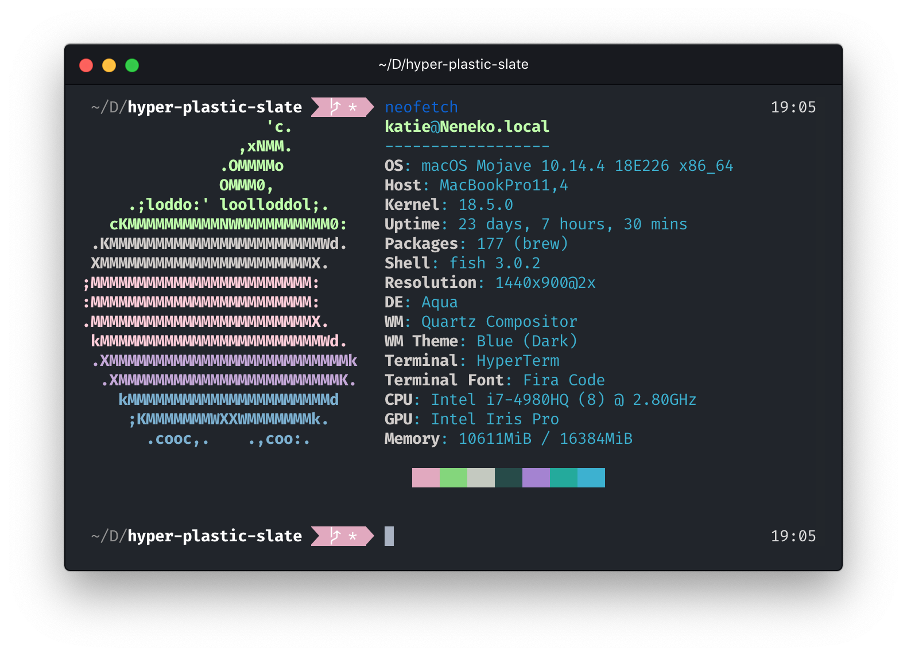

# `hyper-plastic`

[Hyper](https://hyper.is) theme based on [Plastic Slate Theme](https://github.com/kayteh/plastic-slate), which is based on Will Stone's [Plastic Theme](https://will-stone.github.io/plastic/) for VS Code.

**H/T**: @lowmess [hyper-plastic-slate](https://github.com/lowmess/hyper-plastic)

---

  

